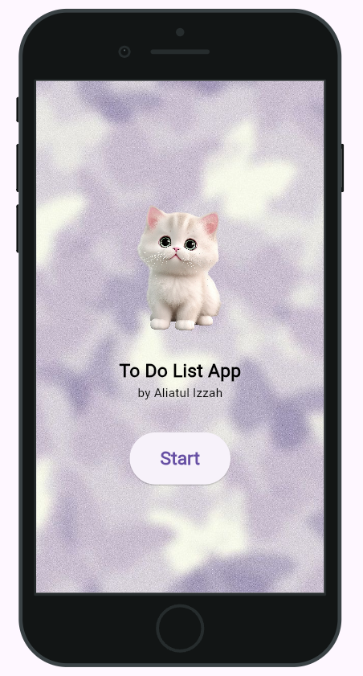
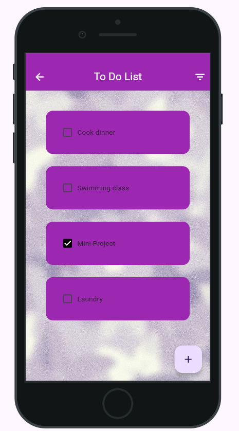
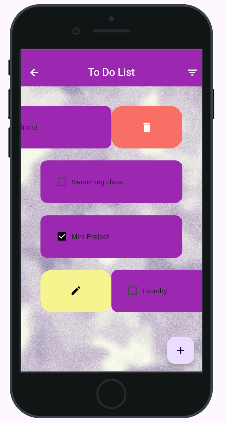

# Flutter Task Management App 💻💖

A simple and intuitive task management app using the Flutter framework during the semester break 2023/2024.

## Hosting Link 🗃️
Click here to open [To Do List App](https://todolist-9a14f.web.app/)

## Features 🌟

- **Task Creation**: Add new tasks. 📝
- **Task Listing**: View all your tasks in an organized list, with the ability to sort and filter. 📋
- **Task Deletion**: Delete tasks that no longer needed, with a confirmation dialog. 🗑️
- **Task Management**: Mark tasks as completed, edit task details, or reopen completed tasks. ✅
- **Responsive Design**: The app is designed to work seamlessly on both Android and iOS devices. 📱

## Technologies Used 🛠️

- **Flutter**: The app is built using the Flutter framework, a cross-platform mobile development toolkit. 🌈
- **Dart**: The app is written in the Dart programming language, which is the primary language used for Flutter development. 🎯

 
p/s : I'm developing this app for fun and it's my first time developing an app. 🎉 Any feedback or suggestions are welcome! 💡
 

## Task Progress 📈

| Date | Task | Status |
|------|------|--------|
| 2023-07-20 | Listing features to be implemented and build the main interface | ✅ Completed |
| 2023-07-21 | Develop task listing with checkbox functionality | ✅ Completed |
| 2023-07-21 | Implement task deletion with confirmation dialog | ✅ Completed |
| 2023-07-22 | Add task management features (mark as complete, edit, reopen) | ✅ Completed  |
| 2023-07-31 | Hosting on firebase| ✅ Completed  |

## App Preview 📸

Here are some previews of the app:

  
  
  

